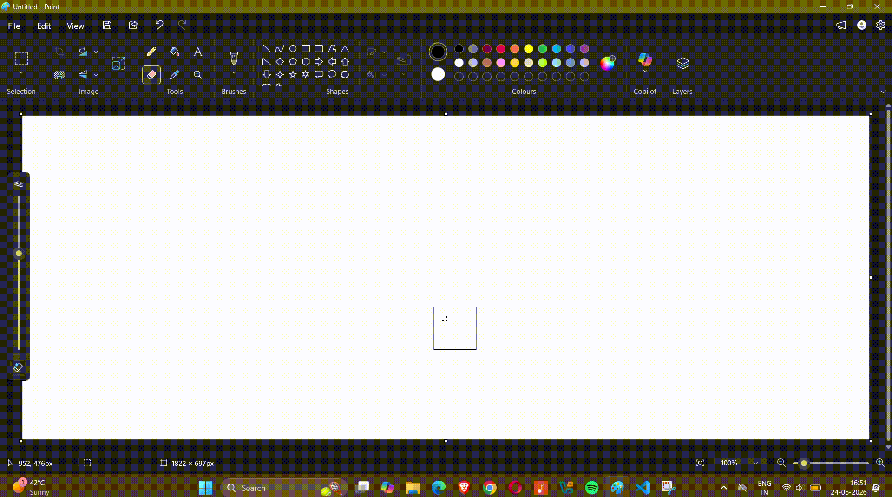
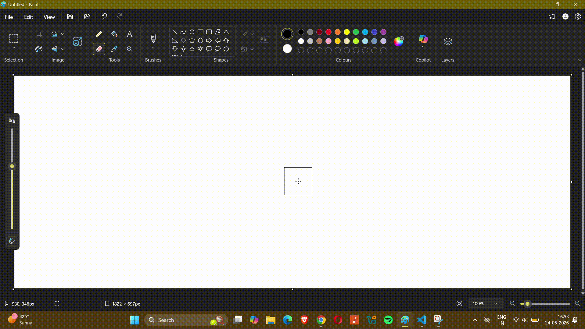
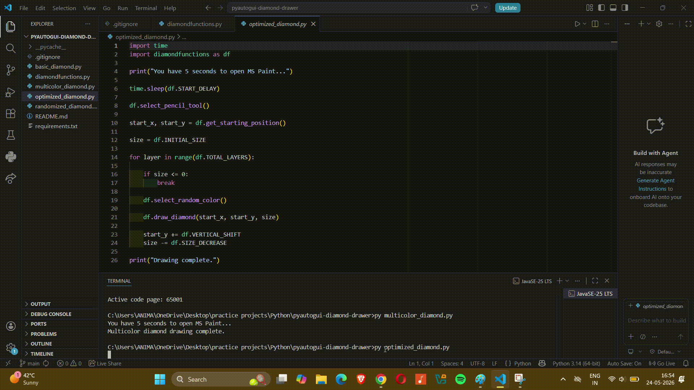
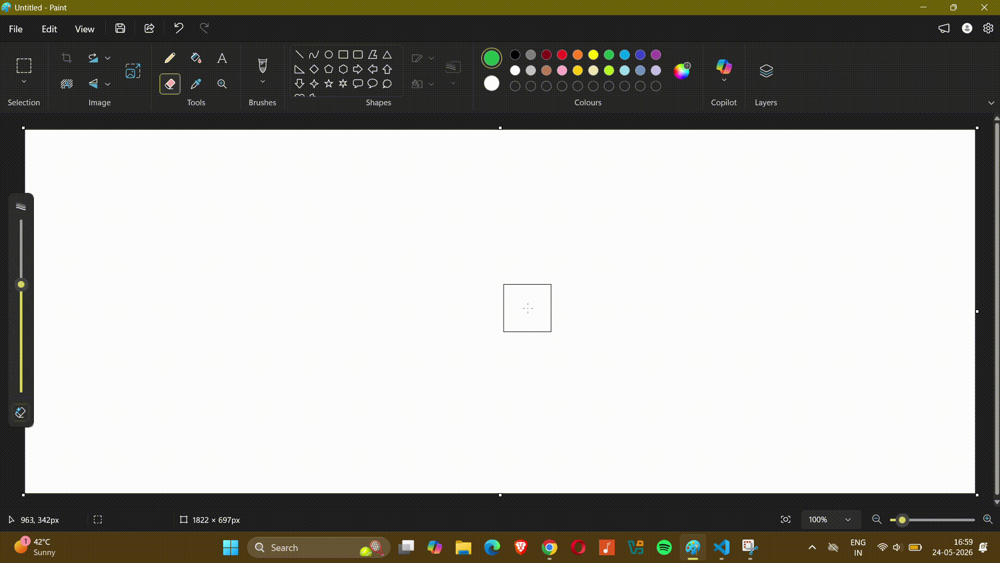
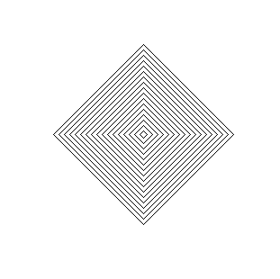
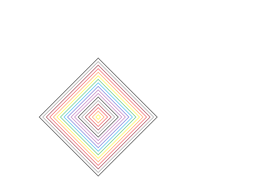
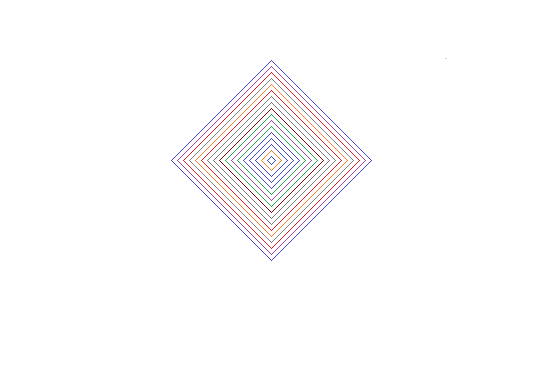

# PyAutoGUI Diamond Drawer

A Python automation project using PyAutoGUI to generate concentric geometric diamond patterns inside MS Paint.

This project explores:
- GUI automation
- Procedural geometry
- Coordinate-based drawing
- Modular Python programming
- Git and GitHub workflow

---

# Features

- Automated mouse movement
- Dynamic cursor positioning
- Concentric diamond generation
- Sequential color cycling
- Randomized color generation
- Modular architecture
- PyAutoGUI fail-safe support

---

# Project Structure

```text
pyautogui-diamond-drawer/
│
├── diamondfunctions.py
├── basic_diamond.py
├── multicolor_diamond.py
├── optimized_diamond.py
├── randomized_diamond.py
├── README.md
└── requirements.txt
```

---

# Installation

Install dependency:

```bash
pip install pyautogui
```

---

# Usage

Run any version:

```bash
python basic_diamond.py
```

```bash
python multicolor_diamond.py
```

```bash
python optimized_diamond.py
```

```bash
python randomized_diamond.py
```

---

# Safety

Move the mouse to the top-left corner of the screen to trigger PyAutoGUI fail-safe.

Because eventually every automation script develops ambitions beyond your original intent.

---

# GIF Demonstrations

## Basic Diamond



---

## Multicolor Diamond



---

## Optimized Diamond



---

## Randomized Diamond



---

# Static Output Images

## Basic Output



---

## Multicolor Output



---

## Randomized Output



---

## Blue Variant Output


---

# Learning Goals

This project helped practice:

- GUI automation
- Mouse control scripting
- Procedural drawing systems
- Python modularization
- Git version control
- GitHub project management
- Automation debugging

---

# Technologies Used

- Python
- PyAutoGUI
- MS Paint
- Git
- GitHub